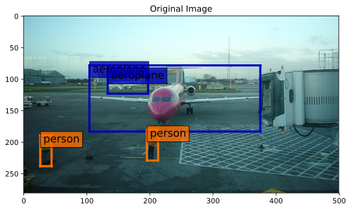

# Object Detection

## Overview
This repository contains code for object detection from RGB data. It is implemented in Tensorflow using Eager Execution API.


## Usage

### 1. Visualize raw
```bash
python src/visualize_raw <path/to/raw/data/>
```
* `-p <path/to/save/plots/>` can be used to specify where to save visualization plots as svg
* `-h` to explore other optional flags


